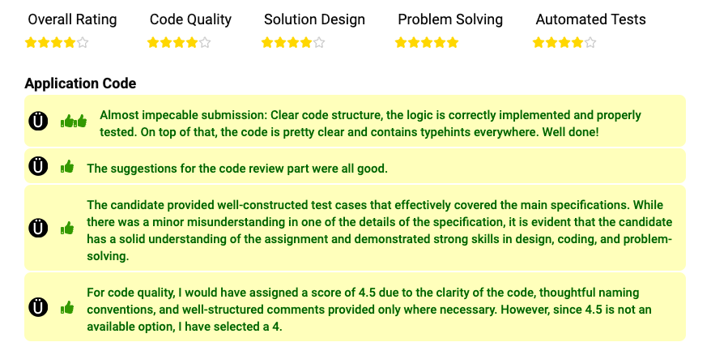

<p></p>

# Multiplayer Word Guessing Game

This project is a backend implementation for a multiplayer word guessing game. Players guess words to reveal hidden characters and earn points based on their guesses.

## Features

- **Multiplayer Gameplay:** Multiple players can play concurrently, submitting guesses without turn-based restrictions.
- **Dynamic Scoring:** Points are awarded for valid guesses based on the number of newly revealed characters. Exact matches score a fixed 10 points.
- **Word Validation:** Words are validated against a provided vocabulary.
- **Game State Management:** Tracks partially revealed words and ensures guesses adhere to game rules.
- **Custom Exceptions:** Provides meaningful error handling for invalid input or game state violations.

## Requirements

- PHP >= 8.1
- Composer for dependency management

## Installation

1. navigate into this root directory

2. Install dependencies using Composer for php test unit:

   ```bash
   composer install
   ```

3. Ensure the `wordlist.txt` file is present in the root directory. This file contains valid vocabulary words, one per line.

## Running Tests

Unit tests are provided to ensure the correctness of the game logic.

Run the tests with PHPUnit:

```bash
./vendor/bin/phpunit --bootstrap vendor/autoload.php tests/
```

### Example Tests

- **Game Initialization:** Ensures the game starts with partially revealed words.
- **Valid Guesses:** Checks that valid guesses reveal characters and score points.
- **Exact Matches:** Verifies scoring for exact word matches.
- **Invalid Submissions:** Handles incorrect guesses gracefully.
- **Game Completion:** Confirms the game identifies when all words are fully revealed.

## Usage

### Initialize the Game

You can create a new game instance with the following code in (examples/command.php)[examples/command.php]

To get output, navigate to root of project, then enter line command

```bash
php examples/command.php
```

## Key Classes

### MultiplayerGuessingGame

An interface defining the core methods:

- `getGameStrings(): array`
- `submitGuess(string $playerName, string $submission): int`

### WordGuessGameManager

Implements the game logic, including:

- Validating guesses.
- Revealing characters in words.
- Calculating and tracking player scores.

### VocabularyCheckerImpl

Loads and validates words from `wordlist.txt`.

### InvalidArgumentException

Custom exception for handling invalid input and game state errors.

---

- Any adjustments to given files will be ignored.
- Create an implementation of this interface to create a game that meets the specification above.
- Please use PHP version >= 8.1 to complete your code.
- Output is not important, so you can develop either for a web server with PHP, or for the PHP command-line interpreter.
- Ideally your solution would not utilise any third party libraries apart from those used for running tests (see below).
- Please include in your submission any tests that you write whilst building out your solution.
- In the composer.json file we have provided autoload already, feel free to use a testing library for writing your unit or integration tests.
- Your code should be production quality.

#### 2. Review the code provided to you in the VocabularyCheckerImpl class.

- Please do not rewrite the code.
- Just add line comments to the file where you think the code could be improved along with your reasoning.
